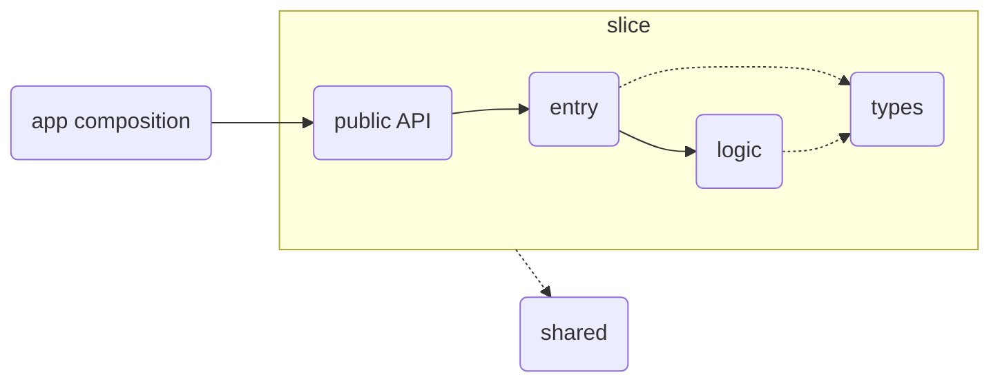
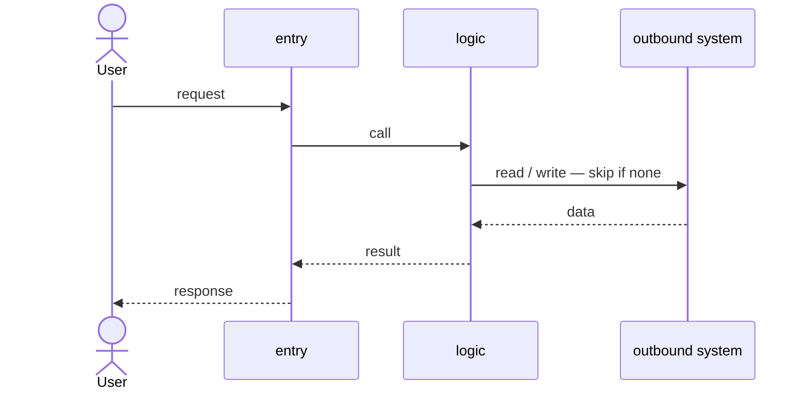

# Architecture — [Project name]

Behavior (RFs): `specs/current/`. Folder pattern: `CLAUDE.md` → Layer Structure. This doc owns the boundaries and the *why*.

## 1. Context
| Item | Value |
|------|-------|
| Users | [Who uses it — e.g. "two players on one device" · "mobile app clients" · "developers in a terminal"] |
| Runs in | [e.g. browser · Node server in Docker · CLI on the user's machine] |
| Inbound | [How requests arrive — e.g. user clicks · HTTP REST · CLI arguments] |
| Outbound | [External systems it calls — e.g. none · PostgreSQL · Stripe API] |
| Persistence | [e.g. none — memory only · PostgreSQL · local JSON file] |

## 2. Slices
| Slice | Responsibility | Public API |
|-------|----------------|------------|
| [slice-name] | [What it owns, in one line] | [What it exports — e.g. `Game` · `ordersRouter` · `runImport`] |

- [App composition — e.g. `App.tsx` · `server.ts` · `main.py`] wires slices together — no feature logic.
- [Shared folder] exists only when 2+ slices need the same code.

## 3. Layers and dependencies

An arrow means "MAY import". Anything not drawn is forbidden.

| Layer | This stack | Owns | NEVER |
|-------|------------|------|-------|
| Entry | [e.g. component · route / controller · command handler] | Receive input, call logic, return or render its result | Hold business rules |
| Logic | [e.g. pure rules · a hook only when state outgrows one `useState` · service / use case] | State, business rules, calls to Outbound systems | Know the transport (DOM, HTTP, terminal) |
| Types | [e.g. `types.ts` only when 2+ files share them · DTOs · `schemas.py`] | Shapes and contracts | Contain runtime logic |
| Public API | [e.g. `index.ts` · `__init__.py` · exported package] | The only door into the slice | Be bypassed by another slice |

## 4. Data model
```
[Core types or tables of the domain — e.g.
type Board = Cell[]   ·   orders(id, user_id, status, total)]
```
- Source of truth: [what is stored, and what is derived from it]

## 5. Runtime flow — [main use case]


## 6. Quality attributes
| Attribute | Target | How the architecture meets it |
|-----------|--------|-------------------------------|
| [e.g. Testability · Latency · Offline] | [e.g. rules tested without I/O · p95 < 200 ms] | [e.g. pure rules, outbound systems mocked at the boundary] |

## 7. Decisions
| Decision | Why | Discarded alternative |
|----------|-----|-----------------------|
| Vertical Slice per feature | A feature changes inside one folder | Folders per type (`components/`, `controllers/`, `services/`) |
| Business rules in the logic layer | One home per rule, testable without the transport | Rules inside components, routes or handlers |
| [Project decision] | [Why] | [Alternative and why not] |

A decision that needs context and options: write an ADR from `docs/decisions/000-template.md` and link it here.
