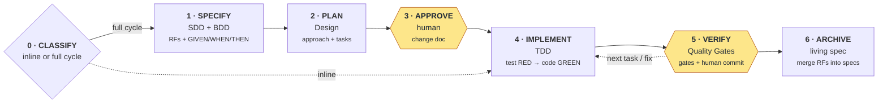

# Spec Driven Development

A ready-to-copy setup for working with **Claude Code** on any project — frontend, backend, API, CLI, library.
Instead of asking the AI for code directly, every change first becomes a written spec you approve — then tests — then code.

The method is stack-agnostic: fill the `[placeholders]` with your stack (see [Adapt it to your stack](#adapt-it-to-your-stack)).

**Why:** the AI stops guessing. You decide *what* gets built before any code exists, every rule has a test, and nothing is committed without your review.

## Requirements
- [Claude Code](https://claude.com/claude-code) installed
- Git
- A project with commands for lint, build and tests — any language or framework

## Quick start
1. Copy everything inside `project/` to the root of your repo — include the hidden `.claude/` folder.
2. Fill the `[placeholders]` in `CLAUDE.md` — Product, Stack, Layer Structure, Conventions, Hard Rules, Spec Rules, Quality Gates.
3. Review `docs/architecture.md` — map its layers to your stack and add your decisions.
4. Add your sensitive and bulky paths to `.claude/settings.json` — the agent will never read them.
5. Run `git init` if the repo has none — the agent stages, you commit.
6. Open Claude Code at the repo root and ask for a change in plain words.

## What a session looks like

```
You:    Create a React tic-tac-toe app: 3x3 board, X and O, win on a line, draw restarts.
Agent:  Size: full cycle — creates the first slice, adds 7 RFs and new dependencies.
        Change doc written: specs/changes/tic-tac-toe-game.md — approve?
You:    yes
Agent:  [ID-001 done] Gates: lint ✅ · build ✅ · tests ✅ — Commit message: chore(app): …
        Next: ID-002 — commit → /clear → go
You:    (commit) /clear → go   ← repeat per task, or "go up to ID-004" for all
Agent:  [Feature closed] Tasks: 4/4 · RFs: 7/7 ✅ — Specs merged: specs/current/game.md
```

## Chat commands
| You say | What happens |
|---------|--------------|
| `<request>, inline` | Small change: no change doc, one commit |
| `<request>, as a feature` | Full cycle: change doc → approval → tasks |
| `yes` | Approve the change doc, or start the next task |
| `go` | Run the active feature's next step — send it after the commit and `/clear` |
| `go up to ID-003` | Run tasks up to ID-003 without asking between them |
| `ok` | Inside a batch: you committed — the next task starts |
| `fix: <what>` | Send the last task back after reviewing its diff |
| `explain` | Get the long version — replies are short on purpose |

No size word: the agent decides and announces `Size: …` — reply "inline" or "as a feature" to override.

## Adapt it to your stack
The phases, change docs, specs and chat commands stay the same. Only these parts change:

| Part | Where | React example | Backend example (Node API) | Python example |
|------|-------|---------------|----------------------------|----------------|
| Stack | `CLAUDE.md` → Stack | React + Vite + TS | Node + Express + TS | Python + FastAPI |
| Slice | `CLAUDE.md` → Layer Structure | `src/features/<feature>/` — component, hook, types, test | `src/modules/<module>/` — route, service, repository, test | `app/<module>/` — router, service, schemas, test |
| Where rules live | `docs/architecture.md` | hooks, not components | services, not routes | services, not routers |
| Quality Gates | `CLAUDE.md` → Quality Gates | `npm run lint` · `npm run build` · `npm test` · `npm audit` | same npm scripts | `ruff check` · `mypy .` · `pytest` · `pip-audit` |
| Test naming | `CLAUDE.md` → Spec Rules | `GAME-01 should …` in Vitest | `ORDER-01 should …` in Vitest / Jest | `test_order_01_…` in pytest |
| Bulky files denied | `.claude/settings.json` | `package-lock.json`, `dist/` | `package-lock.json`, `dist/` | `.venv/`, `__pycache__/` |

RFs describe observable behavior from the outside — UI on a frontend, HTTP responses on an API:
```
ORDER-01 — The system MUST reject an order with no items
  GIVEN an authenticated user | WHEN POST /orders with items: [] | THEN the response is 400 with "items required"
```

## How it works

Yellow = you act. Inline changes skip 1–3 and 6: the agent adds or edits the RF in `specs/current/`, then implements and verifies.

| Phase | The agent | You | Result |
|-------|-----------|-----|--------|
| 0 · Classify | Picks inline or full cycle and says why | Override if you disagree | — |
| 1 · Specify | Writes the rules (RFs) with GIVEN / WHEN / THEN examples | Answer its questions | change doc |
| 2 · Plan | Designs the solution and splits it into tasks | — | change doc |
| 3 · Approve | Waits, then creates branch `feat/<feature>` | Read and approve the change doc | branch |
| 4 · Implement | One task: failing test first, then the code that passes it | — | code + tests |
| 5 · Verify | Runs lint → build → tests → audit, stages, proposes a commit message | Review the diff, commit, `/clear`, say "go" | 1 commit per task |
| 6 · Archive | Copies the new rules into the living spec | Commit, `/clear` | updated spec |

### Inline or full cycle?
| | Inline | Full cycle |
|---|--------|------------|
| When | Adds or changes at most one rule in an existing spec, one slice, no new dependency | Removes rules, adds or changes 2+ rules, needs a new spec, touches 2+ slices, or adds a dependency |
| Change doc and tasks | No | Yes |
| Your approval before code | No | Yes |
| Commits | One | One per task, plus the merge |
| Quality Gates and diff review | Yes | Yes |

### Always true
- No code is written before you approve the change doc.
- A failing gate stops everything — the agent shows the error and proposes options.
- The agent never commits — you do.
- Files denied in `.claude/settings.json` are never read.
- No git repo: branch, staging and commit are skipped and reported as `no repo`.
- Changing code by hand? Edit its RF in `specs/current/` first.
- Clear the chat (`/clear`) after each task commit — the change doc holds the state, `go` resumes it.

## Glossary
| Term | Meaning |
|------|---------|
| RF | Functional requirement — one rule the system MUST follow, with an ID like `GAME-04` |
| GIVEN / WHEN / THEN | A concrete example of an RF — each one becomes a test |
| Living spec | `specs/current/<capability>.md` — what the system does today |
| Change doc | `specs/changes/<feature>.md` — what one change adds, modifies or removes |
| Delta | An RF marked ADDED, MODIFIED or REMOVED inside a change doc |
| Slice | One feature folder with everything it needs — e.g. UI + hook + tests on React, route + service + tests on an API |
| Quality Gates | Your lint → build → tests → audit commands, run after every task |
| ADR | Architecture Decision Record — why a project-wide choice was made |

## Project map
| Path | Purpose |
|------|---------|
| `project/CLAUDE.md` | Global rules the agent follows — a template: fill the `[placeholders]` |
| `project/.claude/settings.json` | Files the agent cannot read: secrets and bulky files |
| `project/.claude/agents/explorer.md` | Read-only explorer — maps multi-slice code and returns only a summary |
| `project/.claude/skills/create-feature/` | The full-cycle skill — specify → plan → approve → implement → verify → archive |
| `project/.claude/skills/_shared/skill-template.md` | Template for adding your own skills |
| `project/docs/architecture.md` | Layers (frontend · backend · CLI) and decisions |
| `project/docs/decisions/` | ADRs — start from `000-template.md` |
| `project/docs/doc-rules.md` | Format rules for every `.md` |
| `project/specs/current/` | Living specs, one per capability — start from `spec-template.md` |
| `project/specs/changes/` | Change docs, one per feature — start from `change-template.md` |

## What we use
Any stack:
- Method: SDD (without bureaucracy) · BDD · TDD (ON/OFF per feature)
- Specs: living spec per capability + deltas per change · RFC 2119 `MUST` in RFs · inline Gherkin `GIVEN | WHEN | THEN` · global RF IDs · RF ↔ task ↔ test traceability
- Code: Vertical Slice · ADRs · KISS / YAGNI · business rules out of the entry layer (components, routes, CLI handlers)
- Tests: behavior not implementation · mock only external boundaries · Arrange / Act / Assert · test name starts with the RF ID
- Tokens: short chat replies · `/clear` between tasks · skills loaded on demand · short gate output · read-only explorer that returns only a summary · bulky files denied
- Process: Quality Gates · human approves tasks and commits · Conventional Commits
