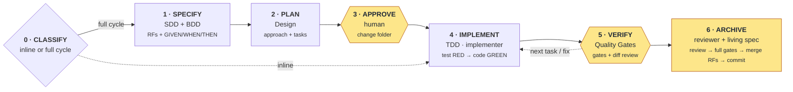

# Spec Driven Development

A copy-and-fill setup for using **Claude Code** on any project — frontend, backend, API, CLI or library.

Every change follows the same order: **written spec → your approval → tests + code**. The agent never guesses what to build, every rule has a test, and only you commit.

## Requirements
- [Claude Code](https://claude.com/claude-code) v2.1.271 or later
- Git
- Commands for lint, build and tests in your project — any language

## Setup
1. Copy everything inside `project/` to your repo root, including the hidden `.claude/` folder.
2. Fill every `[placeholder]` in `CLAUDE.md` (Product, Stack, Layer Structure, Conventions, Hard Rules, Spec Rules) and the gate commands in `.claude/gates.conf` — `FORMAT_*` needs a formatter you approved as a dependency (e.g. prettier); leave it empty to skip formatting.
3. Edit `docs/architecture.md`: context, the layers in your stack and your decisions — the agent adds slices and project-wide decisions at each feature close.
4. Confirm no placeholder is left. This command must print nothing:
   ```
   grep -nE '\[[^]]{2,}\]' CLAUDE.md docs/architecture.md .claude/gates.conf
   ```
5. Add secret and bulky paths (e.g. `.env`, `dist/`, lock files) to the deny list in `.claude/settings.json`.
6. Run `git init` if the repo has no git.
7. Open Claude Code at the repo root and describe the change you want in plain words.

Optional: for a typed language, install its code intelligence plugin with `/plugin` — symbol lookups replace grep + file reads.

### Existing project
Copy `project/` into it, open Claude Code and run `/adopt`. The agent asks you to confirm, then does steps 2–5 from your code — it changes no code.

Your first behavior change in each area runs the full cycle — it creates that area's spec.

## Use it

### Example session
```
You:    Create an orders API: create an order with items, reject an empty order, list a user's orders.
Agent:  Size: full cycle — creates the first slice, adds 5 RFs and new dependencies.
        Change folder written: specs/changes/orders-api/ — approve?
You:    yes
Agent:  [ID-001 done] RED: ORDER-01 failed before code · Gates: lint ✅ · build ✅ · tests ✅ — Staged: app/ …
        Next: ID-002 — /clear → go
You:    /clear, then: go
Agent:  … (repeat per task)
Agent:  [Feature closed] Tasks: 3/3 · RFs: 5/5 ✅ — Commit message: feat(orders): …
You:    git commit
```

### Commands
| Say | Effect |
|-----|--------|
| `<request>` | The agent picks the size and announces `Size: inline` or `Size: full cycle` |
| `<request>, inline` | Force a small change: no change folder, one commit |
| `<request>, as a feature` | Force the full cycle: change folder → approval → tasks |
| `refactor: <what>` | Restructure code without changing behavior: plan → approval → small steps, tests untouched |
| `optimize: <what>` | Improve performance without changing behavior: baseline → plan → approval → measured steps |
| `/adopt` | Existing project: fill the setup from your code — no code changes |
| `yes` | Approve the change folder, or start the next task |
| `go` | Run the next task — send it after `/clear` |
| `go up to ID-003` | Run every task up to ID-003 without stopping |
| `fix: <what>` | Redo the last task after reviewing its diff |
| `explain` | Get a detailed answer — replies are short by default |

### Cheapest way to run a feature
Measured on the benchmark feature before the senior-quality rules: $1.11 vs $1.39 all-Opus (−20%), same quality — not re-measured since.
1. Request the feature with Opus — it writes the change folder; review it.
2. `/model sonnet`
3. `go up to ID-00N` (the last task) — or `/clear → go` per task if you want to review each one (−15%).

### Rules
- Clear the chat (`/clear`) after each task — unless you ran them as a batch with `go up to`. The change folder and staged files keep the state; `go` resumes.
- Review `git diff --staged` before saying `go` or committing.
- Edit the RF in `specs/current/` before changing code by hand.
- Commit yourself. The agent stages files but cannot run `git commit` or `git push`.

### What the agent guarantees
- No code before you approve the change folder.
- A failing gate stops the work; the agent shows the error and proposes options.
- Files denied in `.claude/settings.json` are never read.
- Without a git repo, branch, staging and commit steps are skipped and reported as `no repo`.

## Inline or full cycle
| | Inline | Full cycle |
|---|--------|------------|
| Use when | Adds or changes **at most 1** rule (or none) in an existing spec, in 1 existing slice, with no new dependency | Anything else: removes rules, adds/changes 2+ rules, needs a new spec, touches 2+ slices, or adds a dependency |
| Change doc and tasks | No | Yes |
| Your approval before code | No | Yes |
| Quality Gates and diff review | Yes | Yes |
| Commits | 1 | 1, when the feature closes |

## Phases

Yellow = you act. Inline skips phases 1–3 and 6: the agent edits the RF in `specs/current/` directly, then implements and verifies.

| Phase | Agent | You | Output |
|-------|-------|-----|--------|
| 0 · Classify | Picks inline or full cycle and says why | Override if you disagree | — |
| 1 · Specify | Writes rules (RFs) with GIVEN / WHEN / THEN examples | Answer its questions | change folder |
| 2 · Plan | Designs the solution and splits it into tasks | — | change folder |
| 3 · Approve | Waits, then creates branch `feat/<feature>` | Read the change folder, reply `yes` | branch |
| 4 · Implement | The `implementer` subagent (Sonnet) writes tests and code — failing test first when TDD is ON | — | code + tests |
| 5 · Verify | Runs `gates.sh` (format → lint → build → tests → audit), stages the task | Review the diff, `/clear`, reply `go` | staged task |
| 6 · Archive | The `reviewer` subagent checks the diff against the RFs, then full gates, merges new RFs into the living spec, updates `docs/architecture.md` when a slice or project-wide decision was added, proposes a commit message | Commit, `/clear` | 1 commit |

## Adapt to your stack
Phases, docs and commands never change. Change only these:

| Part | Where | React | Node API | Python |
|------|-------|-------|----------|--------|
| Stack | `CLAUDE.md` → Stack | React + Vite + TS | Node + Express + TS | Python + FastAPI |
| Slice | `CLAUDE.md` → Layer Structure | `src/features/<feature>/` | `src/modules/<module>/` | `app/<module>/` |
| Business rules live in | `CLAUDE.md` → Layer Structure | pure `rules.ts`, not components — a hook only when state outgrows one `useState` | services, not routes | services, not routers |
| Format | `.claude/gates.conf` | `prettier --write` | same | `ruff format` |
| Full gates | `.claude/gates.conf` | `npm run lint` · `npm run build` · `npm test` · `npm audit` | same | `ruff check` · `mypy .` · `pytest` · `pip-audit` |
| Scoped gates | `.claude/gates.conf` | `eslint <files>` · `vitest related <files>` | same | `ruff check <files>` · `pytest <slice>` |
| Test name | `CLAUDE.md` → Spec Rules | `CART-01 should …` | `ORDER-01 should …` | `test_order_01_…` |
| Denied files | `.claude/settings.json` | `package-lock.json`, `dist/` | `package-lock.json`, `dist/` | `.venv/`, `__pycache__/` |

Write RFs as behavior seen from outside — UI on a frontend, HTTP responses on an API:
```
ORDER-01 — The system MUST reject an order with no items
  GIVEN an authenticated user | WHEN POST /orders with items: [] | THEN the response is 400 with "items required"
```

## Glossary
| Term | Meaning |
|------|---------|
| RF | Functional requirement: one rule the system MUST follow, with an ID like `ORDER-04` |
| GIVEN / WHEN / THEN | A concrete example of an RF; each one becomes a test |
| Living spec | `specs/current/<capability>/spec.md` — what the system does today |
| Change folder | `specs/changes/<feature>/` — `proposal.md` · `design.md` · `specs/<capability>/spec.md` (deltas) · `tasks.md` — what one change adds, modifies or removes |
| Delta | An RF marked ADDED, MODIFIED or REMOVED in a change folder's delta spec |
| Slice | The folder, module or package that holds one feature's code |
| Quality Gates | Format → lint → build → tests → audit. Scoped (changed files) after each task; full at feature close and on inline changes. Format rewrites files and blocks only on a syntax error |
| ADR | Architecture Decision Record: why a project-wide choice was made |

## Files
| Path in `project/` | Purpose |
|--------------------|---------|
| `CLAUDE.md` | Global rules for the agent — fill the `[placeholders]` |
| `.claude/settings.json` | Blocks reading secrets and bulky files, `git commit`, `git push` and Claude attribution · allows `gates.sh` |
| `.claude/gates.conf` | Gate commands — fill them per stack |
| `.claude/scripts/gates.sh` | Formats the changed files, runs the gates in order, stops at the first failure, prints one line |
| `.claude/agents/explore.md` | Replaces the built-in `Explore`: Sonnet, no `CLAUDE.md`, returns a summary only |
| `.claude/agents/implementer.md` | Runs one approved task: TDD, scoped gates, change-folder update, staging (Sonnet) |
| `.claude/agents/reviewer.md` | Checks the staged diff against the RFs, Hard Rules and Testing Rules once per feature — gaps only, never style |
| `.claude/skills/create-feature/` | Full-cycle skill: specify → plan → approve → implement → verify → archive |
| `.claude/skills/refactor/` | Refactor skill: green tests → plan → approve → small steps → verify |
| `.claude/skills/optimize/` | Optimize skill: green tests → baseline → plan → approve → measured steps → verify |
| `.claude/skills/adopt-project/` | `/adopt`: fits the setup to an existing project |
| `docs/architecture.md` | Project-wide map: context, slices, layers per stack, quality attributes, decisions — updated at each feature close; per-change design lives in the change folder |
| `docs/decisions/` | ADRs — copy `000-template.md` |
| `docs/doc-rules.md` | Format rules for every `.md` |
| `specs/current/` | Living specs, one folder per capability (`<capability>/spec.md`) — copy `templates/spec.md` |
| `specs/changes/` | Change folders, one per feature — copy `templates/change/` · closed ones move to `archive/<YYYY-MM-DD>-<feature>/` |
| `templates/` | `spec.md` · `change/` · `skill.md` (for your own skills) |

## Principles
- **Method:** lightweight SDD · BDD · TDD (on/off per feature)
- **Specs:** one living spec per capability · deltas per change · RFC 2119 `MUST` · inline `GIVEN | WHEN | THEN` · global RF IDs · RF ↔ task ↔ test traceability
- **Code:** architecture chosen per project · ADRs · KISS / YAGNI · no business rules in entry layers (components, routes, CLI handlers) · no pass-throughs · export only what another file imports · exclusive states as one tagged union · no casts or non-null assertions · semantic, accessible UI · one formatter, run by the gates
- **Tests:** test behavior, not implementation · find elements by role + accessible name · mock only external boundaries · Arrange / Act / Assert · one test per variant a THEN names · test name starts with its RF ID
- **Tokens:** short replies · `/clear` between tasks · tasks run in a Sonnet subagent · skills loaded on demand · gates through one script that prints one line · grep before reading · Explore on Sonnet without `CLAUDE.md` · bulky files denied
- **Measure:** `/usage` (session tokens, prompt cache, share per subagent) · `/context` (what fills the context) · `/doctor prompt-audit` after editing rules, skills or agents
- **Process:** Quality Gates · you approve each task · one commit per feature · Conventional Commits

## Methodologies
Every method this setup applies, where it lives, and what it buys.

### Development
| Method | Origin | Where | Effect |
|--------|--------|-------|--------|
| Spec-Driven Development with delta specs | OpenSpec style | `specs/current/` · `specs/changes/` · `specs/changes/archive/` | The spec, not the chat, is the source of truth; a change lists only ADDED / MODIFIED / REMOVED RFs |
| BDD scenarios in Gherkin style | Behavior-Driven Development · Gherkin `Given / When / Then` | `GIVEN \| WHEN \| THEN` inline under each RF | Each scenario becomes one test — one line instead of a `.feature` file, so no Cucumber runner needed |
| Arrange / Act / Assert | xUnit test pattern | `CLAUDE.md` → Testing Rules | One behavior per test, same shape everywhere |
| Query like a user | Testing Library guiding principles | `CLAUDE.md` → Testing Rules | Tests find elements by role + accessible name — they survive markup changes and enforce accessibility |
| One test per THEN variant | Equivalence partitioning | `CLAUDE.md` → Testing Rules | "Pays by card, PayPal or bank transfer" = 3 tests — no variant left untested |
| Test behavior, mock only boundaries | Classic (Detroit) TDD | `CLAUDE.md` → Testing Rules | Tests survive refactors; only network, database, clock and file system are mocked |
| Test name starts with its RF ID | RF ↔ task ↔ test traceability | Spec Rules · `gates.sh rf` | Every RF is checkable by name |
| TDD with RED evidence | Test-Driven Development | `implementer` · `gates.sh rf` | A test must fail before the code exists; the task line reports it |
| RFC 2119 keywords | IETF RFC 2119 | RFs and every `.md` | `MUST` / `NEVER` leave no room for "should" |
| English, imperative, one idea per line | Anthropic prompt guidance · `docs/doc-rules.md` | every `.md` and skill | Direct orders the model follows literally — fewer words, no ambiguity |
| Single owner per rule | DRY for docs | `docs/doc-rules.md` | `CLAUDE.md` owns global rules; other docs name its section instead of restating it |
| Fixed skill layout | `templates/skill.md` | every skill | Activation Contract → Hard Rules → Decision Gates → Execution Steps → Output Contract |
| Output contracts | — | every skill and agent | Fixed reply shape — short, and easy for the human to scan |
| Vertical slices | Vertical Slice Architecture | `CLAUDE.md` → Layer Structure | A feature changes inside one folder |
| ADRs | Architecture Decision Records | `docs/decisions/` | Project-wide choices keep their reason |
| KISS · YAGNI | — | `CLAUDE.md` → Hard Rules | No abstraction for a use case that does not exist |
| Make illegal states unrepresentable | Typed functional design | `CLAUDE.md` → Hard Rules | Exclusive states are one tagged union — no `isLoading` next to `error` and `data` |
| Minimal public surface | Information hiding | `CLAUDE.md` → Hard Rules | Export only what another file imports, types included — no dead exports |
| Explore → plan → approve → code | Anthropic best practices | `create-feature` steps 1–6 | No code before the human approves the change folder |
| Conventional Commits | conventionalcommits.org | Working Protocol | One readable commit per feature |

### Low verbosity, low bureaucracy
| Method | Origin | Where | Effect |
|--------|--------|-------|--------|
| Process sized to the change | Right-sized ceremony (Lean) | `CLAUDE.md` → Change Size | A one-RF change goes inline: no change folder, no approval round, one commit — the full cycle only when the change needs it |
| No ceremony for no behavior change | — | `refactor` · `optimize` skills | RFs and specs stay untouched; one plan approval covers every step |
| Batch approval | — | `go up to ID-00N` | One "yes" runs several tasks; per-task approval returns only on a failure or a question |
| Delete what does not change behavior | `docs/doc-rules.md` | every `.md` | A line that changes nothing the agent does gets cut |
| No hedging words | `docs/doc-rules.md` · RFC 2119 | every `.md` | No "should", "try to", "ideally" — a rule is `MUST` or it is gone |
| Fewest unambiguous words | `CLAUDE.md` → Chat Replies | every reply | No greeting, no restating the request, no closing summary |
| Output contract, nothing around it | `CLAUDE.md` → Chat Replies | every skill | The agent emits the contract and adds no prose |
| Quote only failing lines | `gates.sh` | every gate run | A passing gate is one line; a failing gate shows only its failing lines |
| ONE question at a time | `CLAUDE.md` → Working Protocol | any unclear point | No questionnaires — ask, wait, continue |
| Detail on demand | `explain` command | any reply | Replies are short by default; `explain` asks for depth |
| Never shorten what matters | `CLAUDE.md` → Chat Replies | RFs · change folders · questions · failure options | Brevity never removes a rule, a scenario or a choice the human needs |
| Minimal human steps | — | Setup · `/adopt` | One confirmation by the agent instead of backups, scripts or extra warnings |

### Quality
| Method | Origin | Where | Effect |
|--------|--------|-------|--------|
| Deterministic gates | Anthropic: "hooks and scripts are deterministic, instructions are advisory" | `.claude/scripts/gates.sh` | Fixed order, stop at the first failure — the model cannot skip or reorder a gate |
| Formatter in the gates, not in the prompt | Deterministic tooling over instructions | `FORMAT_*` in `gates.conf` | The script rewrites style in place — uniform code with no style rule to read and no failing gate for style |
| Evidence, not claims | Anthropic: "have Claude show evidence" | `Gates:` and `RED:` lines | The script prints the result; the agent copies it |
| Fresh-context review against the spec | Anthropic adversarial review · Superpowers spec-compliance review | `reviewer` subagent | A model that did not write the code checks it against the RFs |
| Gaps only, never style | Anthropic: reviewers that chase every finding cause over-engineering | `reviewer` rules | Findings must break an RF, the scope, a Hard Rule or a Testing Rule |
| Stop after 3 failed fixes | Anthropic: "correcting over and over" failure pattern | `implementer` → blocked | A looping fix returns to the human instead of burning tokens |
| Prompt audit | Claude Code `/doctor prompt-audit` | after editing rules, skills or agents | Finds contradictions and stale instructions |

### Tokens
| Method | Origin | Where | Effect |
|--------|--------|-------|--------|
| Fresh context per task | Anthropic context management | `/clear → go` | Each task starts from the change folder, not from the chat |
| Subagent per task on a cheaper model | Superpowers subagent-driven development · opusplan / model routing | `implementer` (Sonnet) | Opus plans, Sonnet implements; the main session never switches model, so its prompt cache survives |
| Filtered tool output | Anthropic hook preprocessing · RTK idea | `gates.sh` | A gate run adds one line to the context instead of its full output |
| Progressive disclosure | Claude Code skills | `.claude/skills/` | Only descriptions load at start; a skill body loads when used |
| Description out of context | `disable-model-invocation: true` | `/adopt` | A once-per-project skill costs nothing in later sessions |
| Short `CLAUDE.md` | Anthropic: under 200 lines | `CLAUDE.md` | Fewer always-loaded tokens and better adherence |
| Path-scoped rules | `.claude/rules/` with `paths:` | `docs/doc-rules.md` | A rule for one area loads only when Claude touches that area |
| Zero-cost notes | `<!-- -->` in `CLAUDE.md` | `docs/doc-rules.md` | Comments are stripped before loading |
| Cheap explorer | Built-in `Explore` override · `omitClaudeMd` · effort per agent | `.claude/agents/explore.md` | Exploration runs on Sonnet at low effort instead of Opus |
| Compaction anchors | Claude Code `Compact instructions` | `CLAUDE.md` | A compacted session keeps the active task, staged files and gate result |
| Search before reading | — | Hard Rules | Reads only the line ranges a task needs |
| Denied bulky files | Permission `deny` rules | `.claude/settings.json` | Lockfiles, build output and secrets never enter the context |
| Short replies | — | `CLAUDE.md` → Chat Replies | No greeting, restating or closing summary |
| Measure before → after | The `optimize` skill, applied to this setup | `/usage` · `/context` | A change stays only if it lowers tokens without failing gates |

### Evaluated and not adopted
| Method | Why not |
|--------|---------|
| One session for the whole feature, no `/clear` | Measured +65% tokens: the Opus session re-read the whole planning context on every turn |
| Explore on Haiku | 16% cheaper, but its summary had a factual error and claimed unrun tests passed |
| caveman (compressed prose) | Near 0% on agentic work in public tests; conflicts with "NEVER shorten RFs" |
| BMAD · Spec Kit | Heavier workflows for the same result |
| MCP code indexers (token-savior, claude-context, code-review-graph) | Tool manifest costs more than it saves on small and medium repos — use a code intelligence plugin instead |
| TDD Guard / Probity | Validates every edit with a model call; `gates.sh rf` covers RED for free |
| `Stop` hook forcing gates | Also blocks when the agent stops to ask a question |
| `MAX_THINKING_TOKENS` | Ignored by adaptive-reasoning models — effort per agent is the control |
