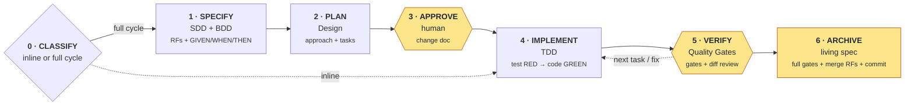

# Spec Driven Development

A copy-and-fill setup for using **Claude Code** on any project — frontend, backend, API, CLI or library.

Every change follows the same order: **written spec → your approval → tests + code**. The agent never guesses what to build, every rule has a test, and only you commit.

## Requirements
- [Claude Code](https://claude.com/claude-code)
- Git
- Commands for lint, build and tests in your project — any language

## Setup
1. Copy everything inside `project/` to your repo root, including the hidden `.claude/` folder.
2. Fill every `[placeholder]` in `CLAUDE.md`: Product, Stack, Layer Structure, Conventions, Hard Rules, Spec Rules, Quality Gates.
3. Edit `docs/architecture.md`: map its layers to your stack and add your decisions.
4. Confirm no placeholder is left. This command must print nothing:
   ```
   grep -nE '\[[^]]{2,}\]' CLAUDE.md docs/architecture.md
   ```
5. Add secret and bulky paths (e.g. `.env`, `dist/`, lock files) to the deny list in `.claude/settings.json`.
6. Run `git init` if the repo has no git.
7. Open Claude Code at the repo root and describe the change you want in plain words.

### Existing project
Do the same setup steps. In step 3, describe the layers your code already has — do not invent new ones.

Code you never touch needs no spec. Run your first behavior change in each capability `as a feature` — the full cycle creates its spec when it closes.

## Use it

### Example session
```
You:    Create a React tic-tac-toe app: 3x3 board, X and O, win on a line, draw restarts.
Agent:  Size: full cycle — creates the first slice, adds 7 RFs and new dependencies.
        Change doc written: specs/changes/tic-tac-toe-game.md — approve?
You:    yes
Agent:  [ID-001 done] Gates: lint ✅ · build ✅ · tests ✅ — Staged: app/ …
        Next: ID-002 — /clear → go
You:    /clear, then: go
Agent:  … (repeat per task)
Agent:  [Feature closed] Tasks: 4/4 · RFs: 7/7 ✅ — Commit message: feat(game): …
You:    git commit
```

### Commands
| Say | Effect |
|-----|--------|
| `<request>` | The agent picks the size and announces `Size: inline` or `Size: full cycle` |
| `<request>, inline` | Force a small change: no change doc, one commit |
| `<request>, as a feature` | Force the full cycle: change doc → approval → tasks |
| `yes` | Approve the change doc, or start the next task |
| `go` | Run the next task — send it after `/clear` |
| `go up to ID-003` | Run every task up to ID-003 without stopping |
| `fix: <what>` | Redo the last task after reviewing its diff |
| `explain` | Get a detailed answer — replies are short by default |

### Rules
- Clear the chat (`/clear`) after each task. The change doc and staged files keep the state; `go` resumes.
- Review `git diff --staged` before saying `go` or committing.
- Edit the RF in `specs/current/` before changing code by hand.
- Commit yourself. The agent stages files but cannot run `git commit` or `git push`.

### What the agent guarantees
- No code before you approve the change doc.
- A failing gate stops the work; the agent shows the error and proposes options.
- Files denied in `.claude/settings.json` are never read.
- Without a git repo, branch, staging and commit steps are skipped and reported as `no repo`.

## Inline or full cycle
| | Inline | Full cycle |
|---|--------|------------|
| Use when | Adds or changes **at most 1** rule (or none) in an existing spec, in 1 existing slice, with no new dependency | Anything else: removes rules, adds/changes 2+ rules, needs a new spec, touches 2+ slices, or adds a dependency |
| Change doc and tasks | No | Yes |
| Your approval before code | No | Yes |
| Quality Gates and diff review | Yes | Yes |
| Commits | 1 | 1, when the feature closes |

## Phases

Yellow = you act. Inline skips phases 1–3 and 6: the agent edits the RF in `specs/current/` directly, then implements and verifies.

| Phase | Agent | You | Output |
|-------|-------|-----|--------|
| 0 · Classify | Picks inline or full cycle and says why | Override if you disagree | — |
| 1 · Specify | Writes rules (RFs) with GIVEN / WHEN / THEN examples | Answer its questions | change doc |
| 2 · Plan | Designs the solution and splits it into tasks | — | change doc |
| 3 · Approve | Waits, then creates branch `feat/<feature>` | Read the change doc, reply `yes` | branch |
| 4 · Implement | Writes tests and code — failing test first when TDD is ON | — | code + tests |
| 5 · Verify | Runs lint → build → tests → audit, stages the task | Review the diff, `/clear`, reply `go` | staged task |
| 6 · Archive | Runs full gates, merges new RFs into the living spec, proposes a commit message | Commit, `/clear` | 1 commit |

## Adapt to your stack
Phases, docs and commands never change. Change only these:

| Part | Where | React | Node API | Python |
|------|-------|-------|----------|--------|
| Stack | `CLAUDE.md` → Stack | React + Vite + TS | Node + Express + TS | Python + FastAPI |
| Slice | `CLAUDE.md` → Layer Structure | `src/features/<feature>/` | `src/modules/<module>/` | `app/<module>/` |
| Business rules live in | `docs/architecture.md` | hooks, not components | services, not routes | services, not routers |
| Full gates | `CLAUDE.md` → Quality Gates | `npm run lint` · `npm run build` · `npm test` · `npm audit` | same | `ruff check` · `mypy .` · `pytest` · `pip-audit` |
| Scoped gates | `CLAUDE.md` → Quality Gates | `eslint <files>` · `vitest related <files>` | same | `ruff check <files>` · `pytest <slice>` |
| Test name | `CLAUDE.md` → Spec Rules | `GAME-01 should …` | `ORDER-01 should …` | `test_order_01_…` |
| Denied files | `.claude/settings.json` | `package-lock.json`, `dist/` | `package-lock.json`, `dist/` | `.venv/`, `__pycache__/` |

Write RFs as behavior seen from outside — UI on a frontend, HTTP responses on an API:
```
ORDER-01 — The system MUST reject an order with no items
  GIVEN an authenticated user | WHEN POST /orders with items: [] | THEN the response is 400 with "items required"
```

## Glossary
| Term | Meaning |
|------|---------|
| RF | Functional requirement: one rule the system MUST follow, with an ID like `GAME-04` |
| GIVEN / WHEN / THEN | A concrete example of an RF; each one becomes a test |
| Living spec | `specs/current/<capability>.md` — what the system does today |
| Change doc | `specs/changes/<feature>.md` — what one change adds, modifies or removes |
| Delta | An RF marked ADDED, MODIFIED or REMOVED in a change doc |
| Slice | The folder, module or package that holds one feature's code |
| Quality Gates | Lint → build → tests → audit. Scoped (changed files) after each task; full at feature close and on inline changes |
| ADR | Architecture Decision Record: why a project-wide choice was made |

## Files
| Path in `project/` | Purpose |
|--------------------|---------|
| `CLAUDE.md` | Global rules for the agent — fill the `[placeholders]` |
| `.claude/settings.json` | Blocks reading secrets and bulky files, `git commit`, `git push` and Claude attribution |
| `.claude/agents/explorer.md` | Read-only explorer: maps code across slices, returns a summary |
| `.claude/skills/create-feature/` | Full-cycle skill: specify → plan → approve → implement → verify → archive |
| `docs/architecture.md` | Layers and architecture decisions |
| `docs/decisions/` | ADRs — copy `000-template.md` |
| `docs/doc-rules.md` | Format rules for every `.md` |
| `specs/current/` | Living specs, one per capability — copy `templates/spec.md` |
| `specs/changes/` | Change docs, one per feature — copy `templates/change.md` |
| `templates/` | `spec.md` · `change.md` · `skill.md` (for your own skills) |

## Principles
- **Method:** lightweight SDD · BDD · TDD (on/off per feature)
- **Specs:** one living spec per capability · deltas per change · RFC 2119 `MUST` · inline `GIVEN | WHEN | THEN` · global RF IDs · RF ↔ task ↔ test traceability
- **Code:** architecture chosen per project · ADRs · KISS / YAGNI · no business rules in entry layers (components, routes, CLI handlers)
- **Tests:** test behavior, not implementation · mock only external boundaries · Arrange / Act / Assert · test name starts with its RF ID
- **Tokens:** short replies · `/clear` between tasks · skills loaded on demand · scoped gates · short gate output · grep before reading · explorer returns summaries only · bulky files denied
- **Process:** Quality Gates · you approve each task · one commit per feature · Conventional Commits
